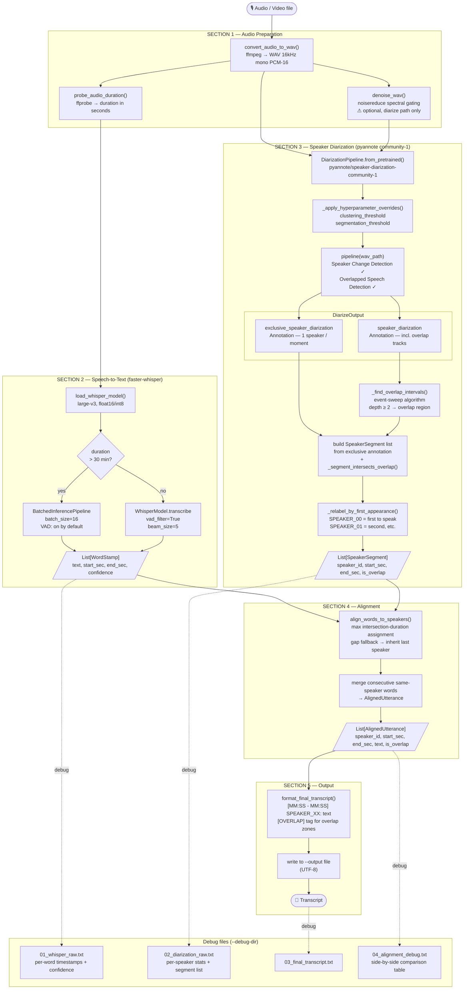
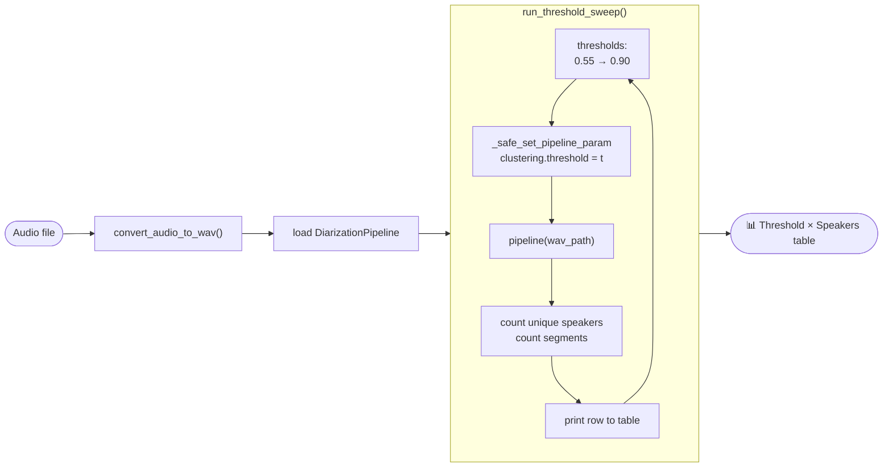
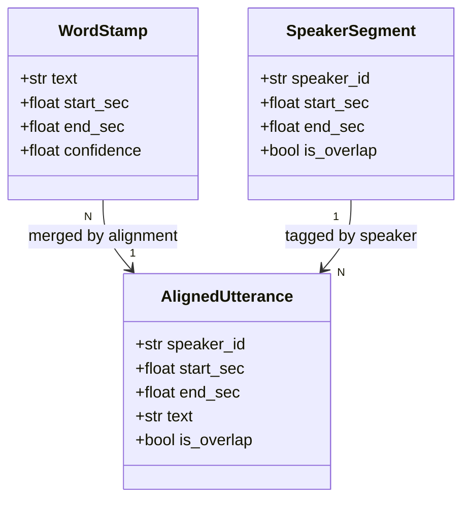

# Architecture — STT + Speaker Diarization Pipeline

## Overview

The pipeline converts any audio/video file into a speaker-labeled transcript
by running two models in parallel and then merging their outputs.

```
Audio file
    │
    ▼
┌─────────────────────────────────────┐
│  ffmpeg: convert to WAV 16kHz mono  │
└─────────────────────────────────────┘
    │                    │
    ▼                    ▼ (if --denoise)
┌──────────┐      ┌─────────────┐
│  original│      │  denoised   │
│   WAV    │      │    WAV      │
└──────────┘      └─────────────┘
    │                    │
    ▼                    ▼
┌──────────────┐  ┌──────────────────┐
│   WHISPER    │  │    PYANNOTE      │
│  large-v3    │  │  community-1     │
│              │  │                  │
│ word-level   │  │ speaker segments │
│ timestamps   │  │ + overlap flags  │
└──────────────┘  └──────────────────┘
    │                    │
    └──────────┬─────────┘
               ▼
    ┌─────────────────────┐
    │  ALIGNMENT          │
    │  max-overlap assign │
    └─────────────────────┘
               │
               ▼
    ┌─────────────────────┐
    │  TRANSCRIPT         │
    │  [MM:SS] SPK: text  │
    └─────────────────────┘
```

---

## Full pipeline flowchart



---

## Diagnose mode flowchart



---

## Data model relationships



---

## Section responsibilities

| Section | Functions | Responsibility |
|---|---|---|
| 1 — Audio | `convert_audio_to_wav` `probe_audio_duration` `denoise_wav` | Normalise input to WAV 16kHz mono; optional denoising for diarize path |
| 2 — STT | `load_whisper_model` `transcribe` | Adaptive ASR (batched vs standard); returns `List[WordStamp]` |
| 3 — Diarize | `diarize` + helpers | Load pyannote, detect overlaps via event-sweep, build + re-label segments |
| 4 — Align | `align_words_to_speakers` | Assign each word to speaker by max temporal overlap; merge into utterances |
| 5 — Format | `format_*` `save_alignment_debug` | Produce human-readable transcript and optional debug files |
| 6 — Orchestrate | `run_pipeline` | Wire steps 1–5; manage temp directory; save outputs |
| 7 — Diagnose | `run_threshold_sweep` | Fast threshold sweep without running Whisper |
| 8 — CLI | `build_arg_parser` `main` | Parse arguments; dispatch to run_pipeline or run_threshold_sweep |

---

## Key design decisions

### Adaptive inference (Section 2)
Audio longer than 30 minutes uses `BatchedInferencePipeline` for throughput.
Shorter audio uses `WhisperModel.transcribe` directly for lower latency.
VAD must be set explicitly (`vad_filter=True`) in the non-batched path.

### Split-input denoising (Section 1 + 6)
When `--denoise` is enabled, only the diarization pass receives the denoised
audio. Whisper always receives the original WAV because spectral gating can
distort phonemes (especially Japanese short vowels and geminate consonants),
which would increase word error rate.

### Overlap detection via event-sweep (Section 3)
Rather than comparing timestamps between two annotations directly (fragile due
to floating-point differences), the pipeline builds an event list of
segment-open (+1) and segment-close (-1) events from `speaker_diarization`,
then sweeps through time. Any interval where depth ≥ 2 is an overlap region.
`exclusive_speaker_diarization` segments are then tagged via interval intersection.

### Chronological speaker re-labeling (Section 3)
pyannote assigns speaker IDs from internal clustering order, not appearance order.
After sorting segments by `start_sec`, the pipeline walks the list once and
assigns `SPEAKER_00` to the first new speaker encountered, `SPEAKER_01` to the
second, and so on. This makes transcripts easier to read.

### Word assignment by max overlap (Section 4)
Each `WordStamp` is assigned to the `SpeakerSegment` whose time interval
overlaps it the most. This is more robust than simple containment checks,
especially at segment boundaries where a word's timestamp may straddle
two adjacent segments.
