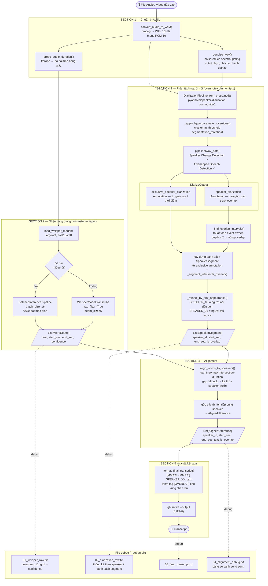
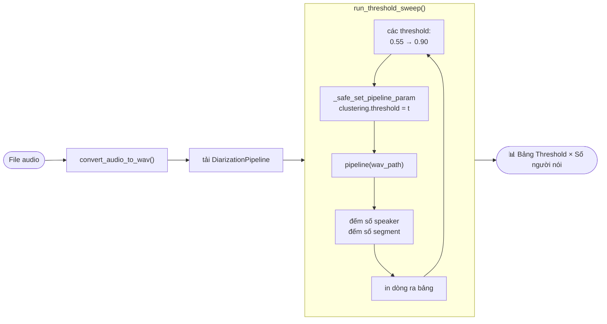
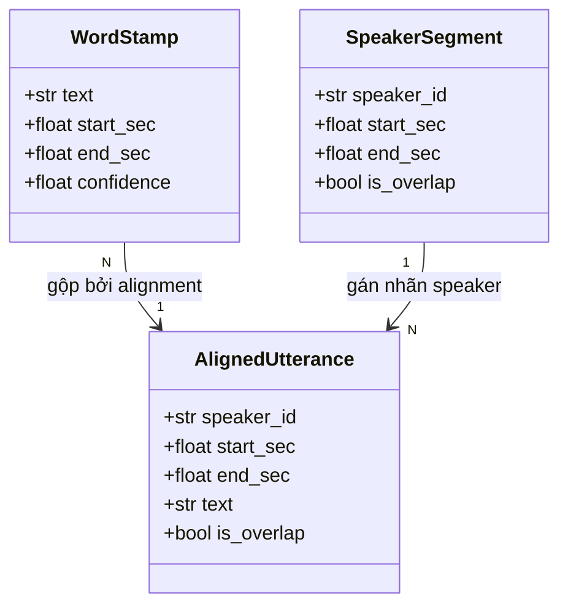

# Kiến trúc — Pipeline STT + Phân tách người nói

## Tổng quan

Pipeline nhận bất kỳ file audio/video nào và tạo ra bản transcript có gán nhãn người nói,
bằng cách chạy song song hai model rồi gộp kết quả lại.

```
File audio
    │
    ▼
┌─────────────────────────────────────┐
│  ffmpeg: chuyển sang WAV 16kHz mono │
└─────────────────────────────────────┘
    │                    │
    ▼                    ▼ (nếu --denoise)
┌──────────┐      ┌─────────────┐
│  WAV gốc │      │  WAV đã khử │
│          │      │   tiếng ồn  │
└──────────┘      └─────────────┘
    │                    │
    ▼                    ▼
┌──────────────┐  ┌──────────────────┐
│   WHISPER    │  │    PYANNOTE      │
│  large-v3    │  │  community-1     │
│              │  │                  │
│ timestamps   │  │ speaker segments │
│ từng từ      │  │ + overlap flags  │
└──────────────┘  └──────────────────┘
    │                    │
    └──────────┬─────────┘
               ▼
    ┌─────────────────────┐
    │  ALIGNMENT          │
    │  gán từ → người nói │
    └─────────────────────┘
               │
               ▼
    ┌─────────────────────┐
    │  TRANSCRIPT         │
    │  [MM:SS] SPK: text  │
    └─────────────────────┘
```

---

## Sơ đồ luồng toàn bộ pipeline



---

## Sơ đồ chế độ Diagnose



---

## Quan hệ giữa các data model



---

## Trách nhiệm từng section

| Section | Hàm | Trách nhiệm |
|---|---|---|
| 1 — Audio | `convert_audio_to_wav` `probe_audio_duration` `denoise_wav` | Chuẩn hoá đầu vào thành WAV 16kHz mono; khử tiếng ồn tuỳ chọn cho nhánh diarize |
| 2 — STT | `load_whisper_model` `transcribe` | ASR thích ứng (batched vs standard); trả về `List[WordStamp]` |
| 3 — Diarize | `diarize` + các hàm hỗ trợ | Tải pyannote, phát hiện overlap bằng event-sweep, xây dựng và đặt lại nhãn segment |
| 4 — Align | `align_words_to_speakers` | Gán từng từ vào speaker theo max temporal overlap; gộp thành utterance |
| 5 — Format | `format_*` `save_alignment_debug` | Tạo transcript dạng người đọc được và các file debug tuỳ chọn |
| 6 — Điều phối | `run_pipeline` | Kết nối các bước 1–5; quản lý thư mục tạm; lưu kết quả |
| 7 — Diagnose | `run_threshold_sweep` | Quét threshold nhanh, không chạy Whisper |
| 8 — CLI | `build_arg_parser` `main` | Phân tích tham số; điều hướng sang `run_pipeline` hoặc `run_threshold_sweep` |

---

## Các quyết định thiết kế quan trọng

### Inference thích ứng theo độ dài (Section 2)

Audio dài hơn 30 phút sử dụng `BatchedInferencePipeline` để tăng throughput.
Audio ngắn hơn dùng trực tiếp `WhisperModel.transcribe` để giảm latency.
Ở nhánh non-batched, VAD phải được bật tường minh (`vad_filter=True`) vì nó không tự động bật như ở nhánh batched.

### Khử tiếng ồn tách biệt cho từng nhánh (Section 1 + 6)

Khi bật `--denoise`, chỉ nhánh diarization nhận file WAV đã khử nhiễu.
Whisper luôn nhận WAV gốc vì spectral gating có thể làm biến dạng âm vị —
đặc biệt là các nguyên âm ngắn và phụ âm geminata trong tiếng Nhật —
dẫn đến tăng word error rate.

### Phát hiện overlap bằng event-sweep (Section 3)

Thay vì so sánh trực tiếp timestamp giữa hai annotation (dễ sai do sai số dấu phẩy động),
pipeline xây dựng danh sách sự kiện mở (+1) và đóng (-1) của từng segment từ `speaker_diarization`,
rồi quét theo thời gian. Bất kỳ khoảng nào có depth ≥ 2 là vùng overlap.
Các segment trong `exclusive_speaker_diarization` sau đó được đánh dấu qua phép kiểm tra giao khoảng thời gian.

### Đặt lại nhãn speaker theo thứ tự xuất hiện (Section 3)

pyannote gán speaker ID theo thứ tự clustering nội bộ, không theo thứ tự xuất hiện trong audio.
Sau khi sắp xếp các segment theo `start_sec`, pipeline duyệt danh sách một lần
và gán `SPEAKER_00` cho speaker mới đầu tiên gặp được, `SPEAKER_01` cho speaker thứ hai, v.v.
Cách này giúp transcript dễ đọc hơn vì số thứ tự khớp với thứ tự lên tiếng thực tế.

### Gán từ theo max overlap (Section 4)

Mỗi `WordStamp` được gán cho `SpeakerSegment` có khoảng thời gian giao nhau nhiều nhất với từ đó.
Cách này bền vững hơn kiểm tra containment đơn thuần, đặc biệt ở ranh giới segment
nơi timestamp của một từ có thể nằm vắt ngang giữa hai segment liền kề.